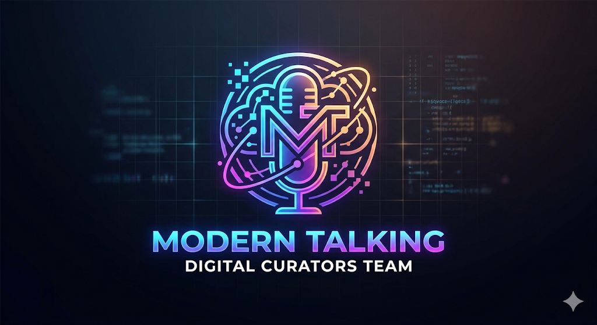

<div align="center">



# Modern Talking — Центр цифровой поддержки
### Modern Talking 


</div>

---

## 📌 Описание проекта

**Modern Talking** — учебный проект Центра цифровой поддержки. Команда выступает как ИТ-подразделение, которое помогает пользователям безопасно работать в интернете: консультирует, ведёт журнал обращений, готовит инструкции и базу знаний, анализирует киберугрозы и решает технические кейсы.

Цель проекта — отработать навыки командной работы через **Git и GitHub**: структура репозитория, ветки, Pull Request'ы, задачи (Issues), документация и база знаний.

## 🎯 Цель проекта

- Организовать совместную работу ИТ-команды через Git и GitHub.
- Создать понятную структуру проектной документации.
- Вести задачи через GitHub Issues.
- Сформировать базу знаний для пользователей.
- Подготовить репозиторий к итоговой защите.

## 👥 Команда и роли

> ⚠️ Замените ФИО на реальных участников вашей команды.

| Участник | Роль | Ветка | Зона ответственности |
|----------|------|-------|----------------------|
| Иванов И. | 🧭 Team Lead / Документация | `feature-documentation` | README, структура, координация |
| Петров П. | 🛡️ Security-инженер | `feature-security` | Инструкции по ИБ, анализ угроз |
| Сидоров С. | 🎧 Консультант поддержки | `feature-consultant` | FAQ, работа с обращениями |
| (участник 4) | 📊 Аналитик / Excel | `feature-excel` | Журнал обращений, статистика |
| (участник 5) | 🎨 Дизайнер | `feature-design` | Логотип, оформление, презентация |

## 🧰 Используемые технологии

- **Git** — система контроля версий
- **GitHub** — хостинг репозитория, Issues, Pull Requests, Pages, Wiki
- **Markdown** — документация и база знаний
- **Microsoft Word / Excel** — отчёты и журнал обращений
- **Python** — вспомогательные скрипты (`/python`)
- **Inkscape / Figma** — логотип (SVG, PNG)

## 🗂️ Структура репозитория

```
.
├── README.md              ← страница проекта (этот файл)
├── docs/                  ← теория, роли, GitHub Pages
│   ├── theory.md
│   ├── roles.md
│   └── index.html
├── excel/                 ← журнал обращений
├── reports/               ← отчёты, технический кейс
│   └── case-report.md
├── presentations/         ← материалы для защиты
│   └── defense-plan.md
├── security/              ← инструкции по информационной безопасности
│   └── security-instructions.md
├── python/                ← вспомогательные скрипты
│   └── password_checker.py
├── design/                ← логотип команды
│   ├── logo.svg
│   ├── logo.png
│   └── logo-description.md
├── knowledge-base/        ← база знаний (FAQ)
│   └── README.md
├── ISSUES.md              ← список задач проекта
├── GIT_GUIDE.md           ← инструкция по работе с Git
└── scripts/
    └── create-issues.sh   ← массовое создание Issues через gh CLI
```

## 📈 Текущий прогресс

- [x] Создана структура репозитория
- [x] Оформлен README
- [x] Подготовлена теоретическая база (`docs/theory.md`)
- [x] Описаны задачи проекта (`ISSUES.md`)
- [x] Сформирована база знаний (22 вопроса-ответа)
- [x] Решён технический кейс (`reports/case-report.md`)
- [x] Разработан логотип (`design/`)
- [x] Подготовлена страница GitHub Pages (`docs/index.html`)

## 🚀 Планы развития

- Подключить автоматизацию (GitHub Actions) для проверки Markdown.
- Расширить базу знаний до 50+ вопросов.
- Перенести FAQ в GitHub Wiki.
- Добавить шаблоны Issues и Pull Request.
- Опубликовать сайт проекта через GitHub Pages.

## 📚 Навигация

- [Теоретический блок](docs/theory.md)
- [Распределение ролей](docs/roles.md)
- [База знаний (FAQ)](knowledge-base/README.md)
- [Технический кейс](reports/case-report.md)
- [Инструкция по Git](GIT_GUIDE.md)
- [Задачи проекта](ISSUES.md)

---
<div align="center">
Центр цифровой поддержки · Modern Talking · 2026
</div>
